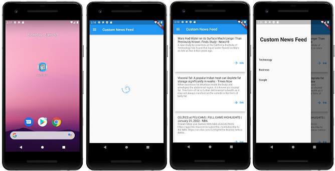

# News Feed Using Flutter
A dummy project in 1 hour to test what flutter can do. I like testing out new frameworks in my spare time, if you have a framework which you would like tested please comment on this repo.


### Notes
- Remember to add a `key.properties` file in `/android` like:
```
storePassword=XXX
keyPassword=XXX
keyAlias=upload
storeFile=XXXX/upload-keystore.jks
```
- The App has not been tested on IOS
- The API key has been removed please get a new one from newsapi.org

# Useful Links
- [How to publish a Flutter app](https://www.youtube.com/watch?v=g1fByAsqQRk)
- [Flutter Documentation - https](//docs.flutter.dev/deployment/android)
- [Lab: Write your first Flutter app](https://flutter.dev/docs/get-started/codelab)
- [Cookbook: Useful Flutter samples](https://flutter.dev/docs/cookbook)
